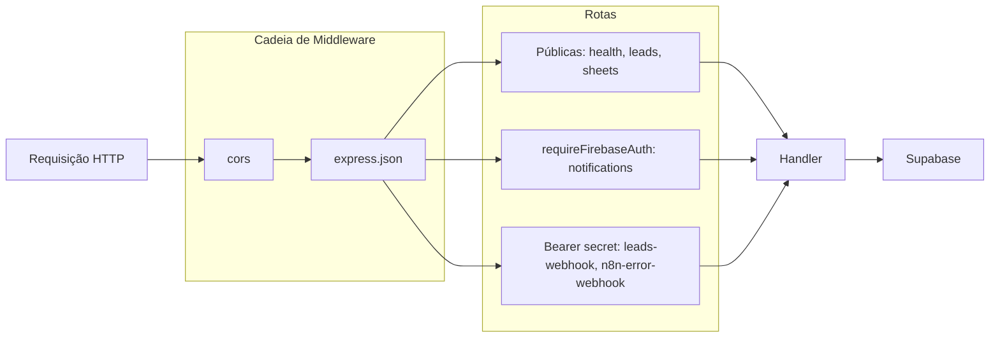

# VexoCrm Backend

API backend do VexoCrm. Localizado em `VexoCrm/backend/`. Roda na VPS com Docker, expõe leads, notificações, proxy do Google Sheets e endpoints de webhook. Toda a lógica está em um único arquivo `server.js`.

## Stack

- Node.js 20
- Express 4
- Supabase JS (acesso ao banco)
- Firebase Admin (validação de ID token)

## Pré-requisitos

- Node.js 18+
- Projeto Supabase com migrações aplicadas
- Projeto Firebase com service account
- n8n (opcional, para webhooks)

## Setup

```sh
cd VexoCrm/backend
npm install
cp .env.example .env
# Preencha todas as variáveis no .env
```

## Executar

```sh
npm run start    # produção
npm run dev      # desenvolvimento (watch)
```

Health check: `curl http://localhost:3001/health`

## Pipeline de Requisições



## Fluxo de Processamento dos Webhooks

```mermaid
flowchart TB
    subgraph leadsWebhook [POST /api/leads-webhook]
        L1[Valida Bearer LEADS_WEBHOOK_SECRET]
        L2[ensureSupabase]
        L3[Normaliza body: client_id, lead ou leads]
        L4[Mapeia campos: telefone, nome, tipo_cliente, etc.]
        L5[Upsert em conflito client_id, telefone]
        L6[Retorna count e ids de sucesso]
    end

    subgraph n8nWebhook [POST /api/n8n-error-webhook]
        N1[Valida Bearer N8N_WEBHOOK_SECRET]
        N2[ensureSupabase]
        N3[Extrai workflow.name, execution.id, error.message]
        N4[Upsert n8n_error_logs]
        N5[Insert notifications]
        N6[Retorna sucesso]
    end

    L1 --> L2 --> L3 --> L4 --> L5 --> L6
    N1 --> N2 --> N3 --> N4 --> N5 --> N6
```



## Referência de Funções

Todas as funções estão definidas em `src/server.js`.

| Função | Assinatura | Descrição |
|--------|------------|-----------|
| `sendError` | `(res, status, code, message, details?)` | Envia resposta JSON de erro padronizada. `details` é opcional e anexado em `error.details`. |
| `ensureSupabase` | `(res) => boolean` | Retorna `false` se Supabase não estiver configurado (envia 500). Retorna `true` caso contrário. Chamar antes de operações Supabase. |
| `requireFirebaseAuth` | `(req, res, next)` | Middleware Express. Valida `Authorization: Bearer <token>`, verifica com Firebase Admin, define `req.authUser`. Envia 401 se ausente/inválido. |
| `normalizeString` | `(value) => string \| null` | Trima e normaliza strings. Retorna `null` para null/undefined/vazio. Remove `=` inicial (artefato de fórmula Excel). |
| `normalizeBool` | `(value) => boolean` | Converte para boolean: `true`, `"true"`, `"TRUE"`, `"1"` → true. |
| `parseCsvLine` | `(line) => string[]` | Parses uma linha CSV com tratamento de aspas. Lida com aspas escapadas. |
| `parseCsvToRows` | `(csv) => object[]` | Parses CSV completo para array de objetos. Primeira linha = headers. |

## Endpoints da API (Detalhado)

### GET /health

**Auth:** Nenhuma

**Resposta:**
```json
{
  "ok": true,
  "timestamp": "2026-03-07T12:00:00.000Z",
  "services": {
    "supabase": true,
    "firebaseAuth": true
  }
}
```

---

### GET /api/leads

**Auth:** Nenhuma

**Query params:**

| Parâmetro | Tipo   | Padrão   | Descrição         |
|----------|--------|----------|-------------------|
| `clientId` | string | `infinie` | Filtro de cliente |

**Resposta:** Ver documentação do VexoCrm.

---

### GET /api/sheets

**Auth:** Nenhuma

**Query params:** `sheetId`, `gid` (obrigatórios)

**Resposta:** `{ "rows": [{ "Coluna1": "valor1", ... }] }`

**Nota:** Planilha deve estar "Publicada na web" (Arquivo > Compartilhar > Publicar na web > CSV).

---

### GET /api/notifications

**Auth:** Bearer Firebase ID token

**Query params:** `limit` (padrão 20, máx 50), `onlyUnread` (string "true"/"false")

**Resposta:** `{ "items": [...], "unreadCount": N }`

---

### PATCH /api/notifications

**Auth:** Bearer Firebase ID token

**Body:** `{ "id": "uuid", "read": true }` ou `{ "markAllRead": true }`

---

### POST /api/leads-webhook

**Auth:** `Authorization: Bearer <LEADS_WEBHOOK_SECRET>`

**Body:** `{ "client_id": "infinie", "lead": {...} }` ou `{ "leads": [...] }`

**Resposta:** `{ "success": true, "count": N, "ids": [...] }`

Chave de upsert: `(client_id, telefone)`.

---

### POST /api/n8n-error-webhook

**Auth:** `Authorization: Bearer <N8N_WEBHOOK_SECRET>`

**Body:** Payload de erro n8n com `workflow.name`, `execution.id`, `error.message`

**Resposta:** `{ "success": true }`

Cria linha em `n8n_error_logs` e `notifications`.

## Códigos de Erro

| Código                    | HTTP | Descrição                                      |
|--------------------------|------|------------------------------------------------|
| `SUPABASE_NOT_CONFIGURED` | 500 | Falta SUPABASE_URL ou SUPABASE_SERVICE_ROLE_KEY |
| `FIREBASE_NOT_CONFIGURED` | 500 | Faltam variáveis Firebase ou service account   |
| `UNAUTHORIZED`           | 401  | Bearer token ausente ou inválido               |
| `INVALID_TOKEN`          | 401  | Falha na verificação do token Firebase         |
| `INVALID_QUERY`          | 400  | Parâmetros de query obrigatórios ausentes      |
| `SHEETS_FETCH_FAILED`   | 502  | Falha ao buscar Google Sheets                  |
| `SHEET_NOT_PUBLIC`      | 403  | Planilha não publicada na web                 |
| `INVALID_BODY`          | 400  | Campos obrigatórios do body ausentes          |
| `LEADS_QUERY_FAILED`    | 500  | Erro na query de leads no Supabase            |
| `LEADS_SAVE_FAILED`     | 500  | Falha no upsert de leads                      |
| `N8N_LOG_SAVE_FAILED`  | 500  | Falha no upsert de n8n_error_logs             |
| `CORS_FORBIDDEN_ORIGIN` | 403  | Origem da requisição não está em CORS_ORIGINS |
| `INTERNAL_ERROR`        | 500  | Exceção não tratada                           |

## Variáveis de Ambiente

| Variável                  | Obrigatória | Descrição                                      |
|---------------------------|-------------|------------------------------------------------|
| `NODE_ENV`                | Não         | `production` para comportamento de produção   |
| `PORT`                    | Não         | Padrão 3001                                   |
| `CORS_ORIGINS`            | Sim (prod)  | Origens separadas por vírgula                 |
| `SUPABASE_URL`            | Sim         | URL do projeto Supabase                       |
| `SUPABASE_SERVICE_ROLE_KEY` | Sim      | Chave service role do Supabase                |
| `LEADS_WEBHOOK_SECRET`    | Sim         | Segredo Bearer do webhook de leads            |
| `N8N_WEBHOOK_SECRET`     | Sim         | Segredo Bearer do webhook de erros n8n        |
| `FIREBASE_PROJECT_ID`    | Sim         | ID do projeto Firebase                        |
| `FIREBASE_CLIENT_EMAIL`  | Sim         | Email da service account do Firebase          |
| `FIREBASE_PRIVATE_KEY`  | Sim         | Chave privada do Firebase (escapar `\n` no env) |

**Fallback:** Se as variáveis Firebase estiverem ausentes, o backend procura `vexocrm-firebase-adminsdk-*.json` no diretório do backend.

## Configuração CORS

- **Desenvolvimento:** `CORS_ORIGINS=*` permite qualquer origem.
- **Produção:** Wildcard é removido. Apenas origens explícitas em `CORS_ORIGINS` são permitidas.
- Requisições sem header `Origin` são sempre permitidas.

## Docker

```sh
docker build -t vexo-api .
docker run --env-file .env -p 3001:3001 vexo-api
```

### Produção (EasyPanel ou manual)

```sh
docker compose -f docker-compose.prod.yml up -d
```

## Deploy

Veja `.cursor/context/topics/deploy.md` para o guia completo (local, com Cursor).
