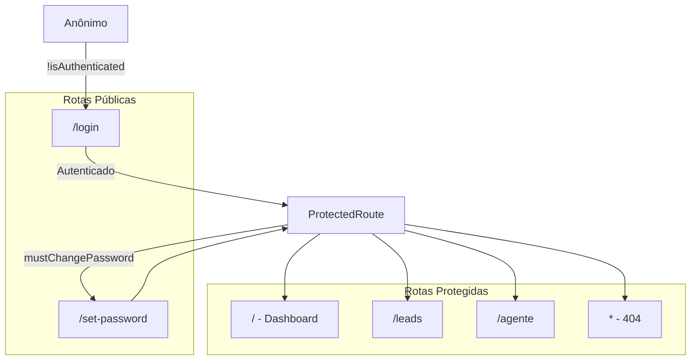
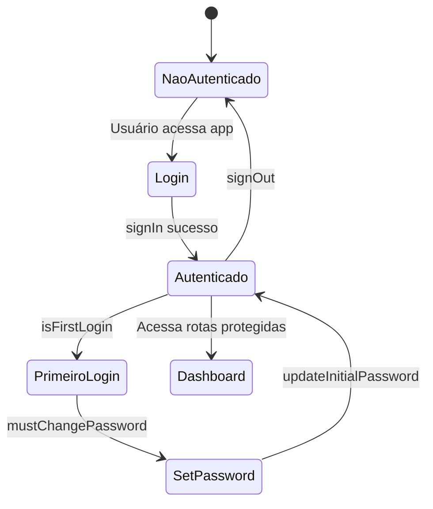
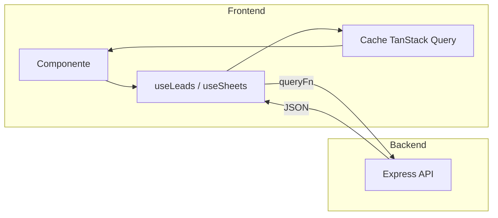

# VexoCrm Frontend

Aplicação frontend do VexoCrm. Localizada em `VexoCrm/frontend/`. Oferece interface unificada para workflows, notificações e interações com agentes. Construída com React, Vite, TypeScript e shadcn/ui.

## Stack

- **Runtime:** Node.js 18+
- **Build:** Vite 5
- **Framework:** React 18
- **Linguagem:** TypeScript
- **UI:** shadcn/ui, Tailwind CSS, Radix UI
- **Auth:** Firebase (email/senha)
- **Backend:** VexoCrm backend (Node/Express na VPS) + Supabase (PostgreSQL)
- **Estado:** TanStack Query, React Hook Form
- **Validação:** Zod

## Pré-requisitos

- Node.js 18+ e npm
- Backend rodando localmente (`http://localhost:3001`) ou na VPS
- Projeto Firebase (vexocrm)

## Setup

```sh
git clone <URL_DO_GIT>
cd VexoCrm/frontend

npm install

# Copie o template de env e preencha
cp .env.example .env
```

### Variáveis de Ambiente

Crie um arquivo `.env` em `frontend/` com:

| Variável | Descrição |
|----------|-----------|
| `VITE_API_BASE_URL` | URL base do backend (ex: `http://localhost:3001` ou `https://api.exemplo.com`) |
| `VITE_FIREBASE_API_KEY` | Chave de API do Firebase |
| `VITE_FIREBASE_AUTH_DOMAIN` | Domínio de auth do Firebase (ex: `vexocrm.firebaseapp.com`) |
| `VITE_FIREBASE_PROJECT_ID` | ID do projeto Firebase |
| `VITE_FIREBASE_STORAGE_BUCKET` | Bucket de storage do Firebase |
| `VITE_FIREBASE_MESSAGING_SENDER_ID` | Sender ID de mensagens do Firebase |
| `VITE_FIREBASE_APP_ID` | ID do app Firebase |
| `VITE_FIREBASE_MEASUREMENT_ID` | Analytics do Firebase (opcional) |

## Mapa de Rotas



## Fluxo de Autenticação



## Fluxo de Dados (React Query)



## Estrutura do Projeto

```
frontend/
├── src/
│   ├── components/       # Componentes UI
│   │   ├── ui/           # Primitivos shadcn/ui (~40 componentes)
│   │   ├── charts/       # RevenueChart, ConversionDonut, PipelineChart
│   │   ├── AppSidebar.tsx
│   │   ├── NotificationBell.tsx
│   │   ├── ProtectedRoute.tsx
│   │   ├── NavLink.tsx
│   │   ├── KpiCard.tsx
│   │   ├── TopSellers.tsx
│   │   └── RecentActivity.tsx
│   ├── contexts/
│   │   └── AuthContext.tsx
│   ├── hooks/
│   │   ├── useLeads.ts
│   │   ├── useNotifications.ts
│   │   ├── useSheets.ts
│   │   ├── use-toast.ts
│   │   └── use-mobile.tsx
│   ├── lib/
│   │   ├── api.ts
│   │   ├── firebase.ts
│   │   ├── sheets.ts
│   │   └── utils.ts
│   ├── pages/
│   │   ├── Index.tsx     # Dashboard
│   │   ├── Leads.tsx
│   │   ├── Agente.tsx
│   │   ├── Login.tsx
│   │   ├── SetPassword.tsx
│   │   └── NotFound.tsx
│   ├── App.tsx
│   └── main.tsx
├── supabase/
│   └── migrations/
├── vercel.json
└── package.json
```

## Referência de Páginas

| Rota | Página | Descrição |
|------|--------|-----------|
| `/` | Index | Dashboard com KPIs, RevenueChart, ConversionDonut, PipelineChart, TopSellers, RecentActivity |
| `/leads` | Leads | Lista de leads do PostgreSQL via `useLeads` |
| `/agente` | Agente | Interface do agente financeiro / notificações |
| `/login` | Login | Login com email/senha |
| `/set-password` | SetPassword | Troca de senha no primeiro login |
| `*` | NotFound | Página 404 |

## Referência de Hooks

| Hook | Propósito |
|------|-----------|
| `useLeads(clientId?)` | TanStack Query para `GET /api/leads`. Retorna `{ data, isLoading, error }`. Padrão `clientId`: `infinie`. Stale: 30s. |
| `useNotifications()` | Polling de `GET /api/notifications` a cada 15s. Retorna `{ items, unreadCount, loading, markAsRead, markAllRead }`. Exibe toast para novos não lidos. Requer auth. |
| `useSheets(config)` | TanStack Query para `GET /api/sheets`. Config: `{ id, name, sheetId, gid }`. Preset `INFINIE_SHEET` disponível. Stale: 60s. |
| `useToast()` | Hook de toast do shadcn |
| `useMobile()` | Hook de breakpoint para layout responsivo |

## Referência Lib / Serviços

| Arquivo | Propósito |
|---------|-----------|
| `api.ts` | Exporta `API_BASE_URL` de `VITE_API_BASE_URL`. Remove barra final. Lança erro se ausente. |
| `firebase.ts` | `loginWithEmail`, `registerWithEmail`, `logout`, `getIdToken`, `changePassword`, `onAuthChange`, `sendPasswordResetEmail` |
| `sheets.ts` | `fetchSheetData({ sheetId, gid })` — busca via proxy do backend, retorna `SheetRow[]` |
| `utils.ts` | `cn(...inputs)` — merge de classes Tailwind (clsx + twMerge) |

## Referência de Componentes

| Componente | Propósito |
|------------|-----------|
| `AppSidebar` | Navegação principal (Dashboard, Leads, Relatórios, Agente, Configurações) |
| `ProtectedRoute` | Envolve rotas protegidas. Redireciona para `/login` se não autenticado, `/set-password` se primeiro login. Exibe spinner durante resolução da auth. |
| `NotificationBell` | Popover com lista de notificações, marcar como lida, marcar todas. Usa `useNotifications`. |
| `NavLink` | Link de navegação da sidebar |
| `KpiCard` | Card de exibição de KPI |
| `RevenueChart` | Gráfico de linha de receita (Recharts) |
| `ConversionDonut` | Gráfico de rosca de conversão |
| `PipelineChart` | Gráfico de funil do pipeline |
| `TopSellers` | Lista de melhores vendedores |
| `RecentActivity` | Lista de atividade recente |

**Componentes UI:** `components/ui/` contém ~40 primitivos shadcn (button, card, dialog, table, input, etc.). Use como blocos de construção.

## Leads (PostgreSQL + n8n)

Os leads são armazenados no PostgreSQL. A página `/leads` lê da tabela `leads` via `GET /api/leads`.

### Setup

1. Execute as migrações no Supabase (`supabase db push` ou SQL Editor).
2. Configure `LEADS_WEBHOOK_SECRET` em `backend/.env`.
3. Faça deploy do backend na VPS.

### Requisição HTTP do n8n

Adicione um nó HTTP Request ao workflow:

- **Método:** POST
- **URL:** `https://<BACKEND>/api/leads-webhook`
- **Headers:** `Authorization: Bearer <LEADS_WEBHOOK_SECRET>`
- **Body (JSON):** Ver documentação do backend.

Para lote: `{ "leads": [{ ... }, { ... }] }`. Upsert por `(client_id, telefone)`.

## Desenvolvimento

```sh
# Da raiz do Vexo (recomendado)
.\start.ps1              # Apenas frontend
.\start.ps1 -All         # Backend + frontend

# Ou de frontend/
npm run dev

# Rodar testes
npm run test

# Lint
npm run lint

# Build para produção
npm run build

# Preview do build de produção
npm run preview
```

## Deploy

- **Vercel:** Defina Root Directory como `frontend` (ou `VexoCrm/frontend`). Configure `VITE_API_BASE_URL` e variáveis Firebase no dashboard.
- **Backend:** Deploy separado na VPS (veja [README Backend](../backend/README.md)).

## Relacionados

- [README Backend](../backend/README.md)
- [README VexoCrm](../README.md)
- [README Import Leads](../scripts/README-import-leads.md)
- Contexto e decisões: `.cursor/context/` (local, com Cursor)
