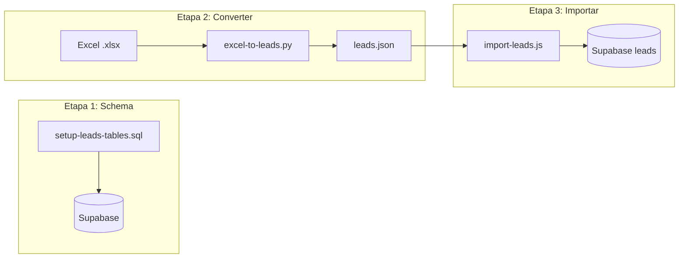

# Importar Leads do Excel

Este documento descreve o pipeline para importar leads de uma planilha Excel para o Supabase. O processo tem três etapas: criar tabelas, converter Excel para JSON e importar JSON para o Supabase.

## Visão do Pipeline



## Pré-requisitos

- **Projeto Supabase** com migrações aplicadas (ou execute `setup-leads-tables.sql` manualmente)
- **Python 3** com `pandas` e `openpyxl`: `pip install pandas openpyxl`
- **Node.js 18+** (para o script de importação)
- **Backend `.env`** com `SUPABASE_URL` e `SUPABASE_SERVICE_ROLE_KEY`

## Etapa 1: Criar Tabelas (se não existirem)

Se as migrações não foram executadas, crie as tabelas de leads no Supabase.

**Opção A: SQL Editor do Supabase**

1. Abra Supabase Dashboard → SQL Editor → Nova query
2. Cole e execute o conteúdo de `scripts/setup-leads-tables.sql`

**Opção B: Migrações**

Execute as migrações em `frontend/supabase/migrations/` em ordem:

- `20260304000001_create_leads_tables.sql`
- `20260304000002_seed_leads_infinie.sql` (seed opcional)

## Etapa 2: Converter Excel para JSON

O script Python lê um arquivo Excel e gera `leads.json` no mesmo diretório do script (`VexoCrm/scripts/`).

```powershell
cd VexoCrm
python scripts/excel-to-leads.py "C:\caminho\para\planilha-leads-infinie.xlsx"
```

**Saída:** `VexoCrm/scripts/leads.json`

**Caminho padrão:** Se nenhum argumento for passado, o script usa `~/Downloads/planilha-leads-infinie (1).xlsx`.

### Colunas Obrigatórias do Excel

O script espera estes nomes de coluna (sensível a maiúsculas):

| Coluna Excel      | Campo JSON      | Observações                                      |
|-------------------|-----------------|--------------------------------------------------|
| Telefone          | telefone        | Obrigatório. Se 11 dígitos ou menos, adiciona `55` |
| Nome              | nome            |                                                  |
| Tipo de Cliente   | tipo_cliente    |                                                  |
| Faixa de Consumo  | faixa_consumo   |                                                  |
| Cidade            | cidade          |                                                  |
| Estado            | estado          |                                                  |
| Conta de energia  | conta_energia   |                                                  |
| status            | status          |                                                  |
| Bot Ativo         | bot_ativo       | Convertido para boolean                          |
| Historico         | historico       |                                                  |
| Data e Hora       | data_hora       |                                                  |
| Qualificacao      | qualificacao    |                                                  |

### Schema do leads.json

Cada item do array:

```json
{
  "client_id": "infinie",
  "telefone": "5534999999999",
  "nome": "Cliente",
  "tipo_cliente": "residencial",
  "faixa_consumo": "R$ 300",
  "cidade": "Uberlândia",
  "estado": "MG",
  "conta_energia": null,
  "status": "em_qualificacao",
  "bot_ativo": true,
  "historico": "...",
  "data_hora": "2026-03-04T12:00:00.000-03:00",
  "qualificacao": null
}
```

## Etapa 3: Importar para o Supabase

**A partir da raiz do VexoCrm:**

```powershell
cd VexoCrm/backend
node scripts/import-leads.js
```

**Requer:** `backend/.env` com `SUPABASE_URL` e `SUPABASE_SERVICE_ROLE_KEY`.

O script:

1. Lê `VexoCrm/scripts/leads.json`
2. Garante que `leads_clients` tenha o cliente (ex: `infinie`)
3. Faz upsert em `leads` em `(client_id, telefone)` — duplicatas são atualizadas

## Comando Único (da raiz do Vexo)

```powershell
python VexoCrm/scripts/excel-to-leads.py "C:\Users\W11\Downloads\planilha-leads-infinie.xlsx"
cd VexoCrm/backend; node scripts/import-leads.js
```

## Tratamento de Erros

| Erro | Causa | Solução |
|------|-------|---------|
| `File not found` | Caminho do Excel inválido | Verifique o caminho, use caminho absoluto se necessário |
| `Failed to read leads.json` | Etapa 2 não executada ou JSON ausente | Execute `excel-to-leads.py` primeiro |
| `No leads in leads.json` | JSON vazio ou inválido | Verifique se o Excel tem dados e coluna Telefone válida |
| `Missing SUPABASE_URL or SUPABASE_SERVICE_ROLE_KEY` | Env do backend não configurado | Copie `.env.example` para `.env` e preencha |
| `Table 'leads' may not exist` (42P01) | Migrações não executadas | Execute a Etapa 1 |

## Troubleshooting

1. **Nomes das colunas:** Garanta que o Excel tenha exatamente os nomes acima (incluindo espaços, ex: "Tipo de Cliente").
2. **Telefone:** Linhas sem Telefone válido são ignoradas.
3. **Encoding:** O script usa UTF-8 para `leads.json`. Se o Excel tiver caracteres especiais, salve o arquivo corretamente.
4. **Comportamento do upsert:** Re-executar a importação com o mesmo Excel atualizará os leads existentes (mesmo `client_id` + `telefone`).
